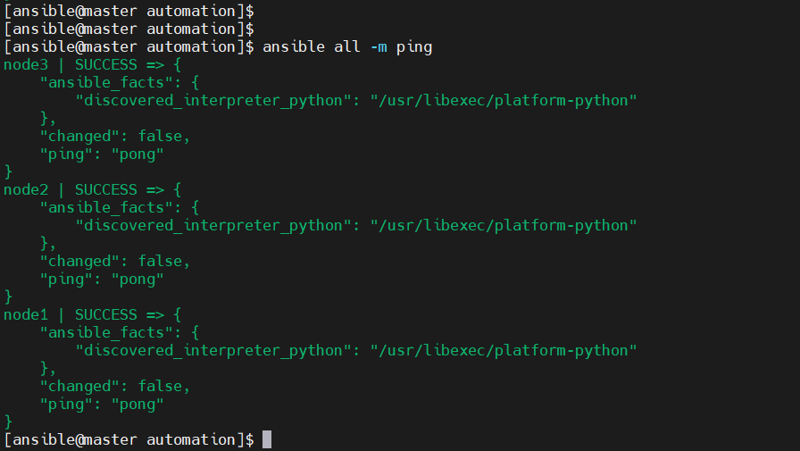

# Ansible-Automation-Infrastructure


Ansible is an open-source automation platform used to:

- Automate: Software provisioning, configuration management, and application deployment.
- Manage: Large numbers of systems at once.
- Orchestrate: Complex IT workflows across different environments

  📑 **Table of Contents**
- [How You Use This Infrastructure](#how-you-use-this-infrastructure)
- [Prerequisites](#prerequisites)
- [Ansible Dev Automation](#Ansible-dev-automation)
- [Infrastructure](#infrastructure)
- [Playbooks](#playbooks)
- [System prerequisites](#system-prerequisites)
- [Setup](#setup)


Audience

This environmnet is intended for system engineers, system administrators, Cloud Admin, DevOps engineers.
- `Use Case`:
- Maintain consistency across servers, enforce configuration standards, deploy applications or services and perform repetitive tasks without human error

##  How You Use This Infrastructure

Use Case: Learn and Practice Ansible. This is a safe, Dev lab to:

- Experiment with Ansible modules and playbooks
- Understand YAML syntax and automation design
- Try failed scenarios and recoveries

  ##  Prerequisites

- VMware, cloud or any environment suitable
- Rocky Linux 8 ISO
- Basic networking and SSH setup

  # Ansible Dev Automation

This project sets up a full Ansible Development environment using Vmware and Rocky Linux 8. It covers:

- Ansible control node + 3 worker nodes
- SSH key authentication setup
- Real-world automation tasks using Ansible

## Infrastructure

| Hostname       | Role          | IP Address      |
|----------------|---------------|------------------|
| ansible-master | Control Node  | 192.168.56.10 |
| worker1        | Managed Node  | 192.168.56.11 |
| worker2        | Managed Node  | 192.168.56.12 |
| worker3        | Managed Node  | 192.168.56.13 |

##  Playbooks

- `users.yml`: Add users
- `firewall.yml`: Configure firewalld
- `motd.yml`: Customize login banner
- `cronjobs.yml`: Setup system update cron job

##  Run Playbooks

``ansible-playbook -i inventory/hosts.ini playbooks/users.yml``


## System prerequisites

**All systems should be** 
- Rocky Linux 8 Minimal
- user: ansible
- SSH enabled


## Setup

- **Update All Nodes**

`sudo dnf update -y`
`sudo dnf install epel-release -y`

- **Install python and podman**

  `dnf install python3 python3-pip podman`

- **Set Static Hostnames**

<pre> ```  
          sudo hostnamectl set-hostname ansible-master        # on master 
          sudo hostnamectl set-hostname worker1               # on worker1 
          sudo hostnamectl set-hostname worker2               # on worker2 
          sudo hostnamectl set-hostname worker3               # on worker3 ``` </pre>

- **Add to /etc/hosts on all machines:**
  

<pre> ```
        192.168.56.10        ansible-master 
        192.168.56.11        node1 
        192.168.56.12        node2 
        192.168.56.13        node3 ``` </pre>

- **Create a Common Ansible User (If not already)** 

- `useradd ansible`
- `echo "ansible:password" | sudo chpasswd`
- `echo "ansible ALL=(ALL) NOPASSWD: ALL" >> /etc/sudoers.d/ansible`

- **Install Ansible (on Master only)**
  
- `sudo dnf install ansible -y`
- `ansible --version`

- **Setup Passwordless SSH from Master → Workers**

  Login as ansible on the master node:

- `su - ansible`
- `ssh-keygen`

- **Copy the SSH key to all workers:**

- `ssh-copy-id ansible@wnode1`
- `ssh-copy-id ansible@node2`
- `ssh-copy-id ansible@node3`

- **Create an automation project directory where you are going to be working from**
- `Sign into the master server as user ansible. ssh ansible@master`
- `Create the automation directory. mkdir automation`
- `Create both inventory and ansible.cfg files as shown bellow`

  


- **test conectivity betwwen master and all nodes by using the ping command**

  
